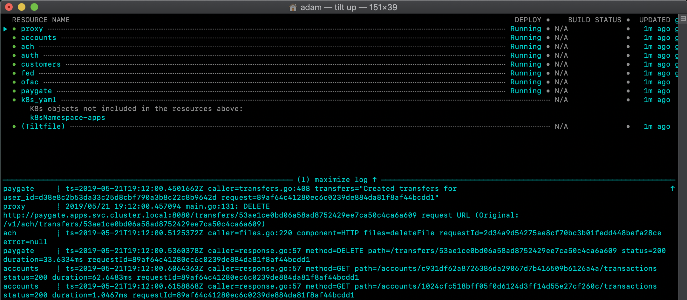

## moov.io infra

This repository holds the configurion for [moov.io](https://github.com/moov-io)'s infrastructure. If you find a problem (security or otherwise), please contact us at [`security@moov.io`](mailto:security@moov.io).

[](https://godoc.org/github.com/moov-io/infra)
[](https://travis-ci.com/moov-io/infra)
[](https://raw.githubusercontent.com/moov-io/infra/master/LICENSE)

Links: [Grafana](https://infra.moov.io/grafana/) | [Prometheus](https://infra.moov.io/prometheus/) | [Traefik](https://infra.moov.io/traefik/dashboard/)

### Project Goals

This project aims to be the structure and runtime for a fully automated hosting of moov.io services.

### Getting started

To get started working on this project, pull down (`git clone git@github.com:moov-io/infra`) the source code and setup some configs.

You'll need to have the following tools setup as well:

- [Golang](https://golang.org/dl)
- Terraform | [Download](https://www.terraform.io/downloads.html) | [Intro](https://www.terraform.io/intro/index.html)
- kubectl | [Download](https://kubernetes.io/docs/tasks/tools/install-kubectl/) | [Intro](https://www.digitalocean.com/community/tutorials/an-introduction-to-kubernetes)
- [Blackbox](https://github.com/StackExchange/blackbox#blackbox-) (Installed at `./lib/blackbox/bin`, add this to `PATH`)
- [gcloud CLI](docs/google-cloud.md)
- Docker for either [Linux](https://docs.docker.com/install/linux/docker-ce/ubuntu/) or [macOS](https://docs.docker.com/docker-for-mac/install/).

On macOS these tools can be installed with the following homebrew command:

```
$ brew install gpg2 jq make terraform go
```

The project has the following directories:

- [`docs/`](https://github.com/moov-io/infra/tree/master/docs) - Human readable documentation.
- `envs/`
  - [`envs/sbx/`](https://github.com/moov-io/infra/tree/master/envs/sbx) - Our production (and only) environment currently.
- [`images/`](https://github.com/moov-io/infra/tree/master/images) - Docker images we create and manage
- [`lib/`](https://github.com/moov-io/infra/tree/master/lib) - Shared (Kubernetes) resources across environments

### Local Development

We support a local development environment to allow anyone the ability to run Moov's application stack locally on a machine. This currently requires a few tools to be installed, such as:

- Docker
  - [Docker for Mac](https://docs.docker.com/docker-for-mac/) - [Install Guide](https://docs.docker.com/docker-for-mac/install/)
  - [Docker on Linux](https://docs.docker.com/install/)
  - [Docker for Windows](https://docs.docker.com/docker-for-windows/) - [Install Guide](https://docs.docker.com/docker-for-windows/install/)
- [Tilt](https://tilt.dev/) - [Install Guide](https://docs.tilt.dev/install.html)

Once these tools are setup run the following commands from the root of this repository.

```
$ cd envs/dev
$ tilt up
```

This brings up a prompt that looks like the following image. Use the arrow keys to move between containers and `<enter>` to pull up a specific container's log.



You should also be able to ping services (ACH ping: http://localhost:8080/ping) or even run [`apitest -local`](https://github.com/moov-io/api/tree/master/cmd/apitest). `apitest` can be installed with `go get github.com/moov-io/api/cmd/apitest`.

### Testing

We run several kinds of tests against this repository. Linters/validators (over Kubernetes, Terraform, Prometheus configs) as well as Docker image builds. To run all these:

```
$ make test
```

Note: To run these tests you need Docker installed.

### Runbooks

- [Google Cloud (GKE)](docs/google-cloud.md)
- [In-repo Secrets (Blackbox)](docs/secrets.md)
- [Kubernetes](docs/kubernetes.md)
- [Load balancing / Routing (Traefik)](docs/traefik.md)

### Getting Help

 channel | info
 ------- | -------
 Google Group [moov-users](https://groups.google.com/forum/#!forum/moov-users)| The Moov users Google group is for contributors other people contributing to the Moov project. You can join them without a google account by sending an email to [moov-users+subscribe@googlegroups.com](mailto:moov-users+subscribe@googlegroups.com). After receiving the join-request message, you can simply reply to that to confirm the subscription.
Twitter [@moov_io](https://twitter.com/moov_io)	| You can follow Moov.IO's Twitter feed to get updates on our project(s). You can also tweet us questions or just share blogs or stories.
[GitHub Issue](https://github.com/moov-io) | If you are able to reproduce an problem please open a GitHub Issue under the specific project that caused the error.
[moov-io slack](http://moov-io.slack.com/) | Join our slack channel to have an interactive discussion about the development of the project.

### Contributing

Yes please! Please review our [Contributing guide](CONTRIBUTING.md) and [Code of Conduct](CODE_OF_CONDUCT.md) to get started!

### License

Apache License 2.0 See [LICENSE](LICENSE) for details.
