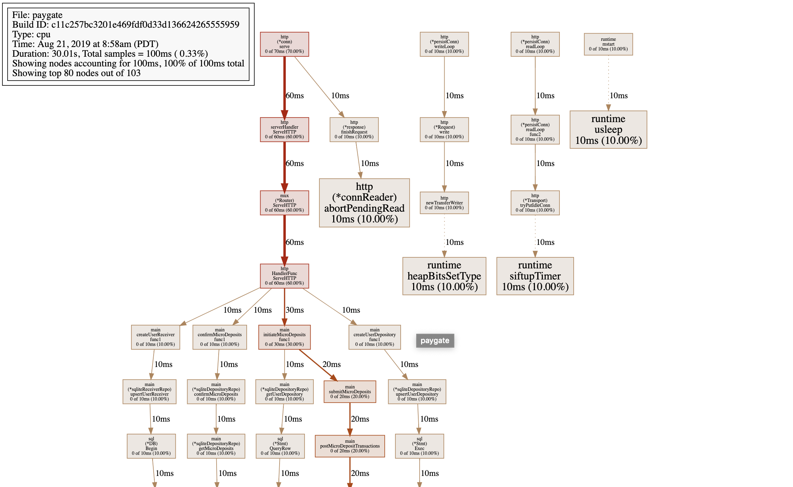

## Go debugging

### Code Coverage Thresholds

When running tests (via `make check`) using our linting script you can specify a threshold for "code coverage" which is the percent of statements executed during testing. A higher value means more of your program/system is tested. Typically +80-85% is a good starting point. Very well tested codebases have +90-95% coverage.

```yaml
    - name: Check
      env:
        COVER_THRESHOLD: 85.0
      run: make check
```

### Linting

We run a series of linters over all Go code in CI. This is done with the `./go/lint-project.sh` which runs linters such as: `go fmt`, misspell, staticcheck, nancy, golangci-lint, gocyclo, gitleaks (experimental), and exhaustive (experimental). Lastly `go test` is ran.

The following variables can be used to configure the linters:

- `GITLEAKS_DEPTH=10`
- `GOCYCLO_LIMIT=15`
- `IGNORED_CVES=CVE-XXXX-YYYY,CVE-ZZZZ-XXX`
- `MISSPELL_IGNORE="palestiniens,palestinians"`

Experiemtnal linters can be enabled:

- `EXPERIMENTAL=gitleaks,exhaustive`

### Production Debugging

- [Profiling Go Programs](https://blog.golang.org/profiling-go-programs)
- [SRE: Debugging: Simple Memory Leaks in Go](https://medium.com/dm03514-tech-blog/sre-debugging-simple-memory-leaks-in-go-e0a9e6d63d4d)
- [Useful features of Go in Production Deployments](https://rakyll.org/go-cloud/)

### Connect to remote pprof endpoint

We use Go's support for `pprof` profiles to analyze running applications. This allows us insight into memory, cpu, and other metrics around a running application. Moov's [admin http.Handler](https://godoc.org/github.com/moov-io/base/admin#Handler) registers the standard Go pprof handles on the admin HTTP server. ([code](https://github.com/moov-io/base/blob/master/admin/admin.go#L121))

You can inspect the pprof endpoints of a running Kubernetes Pod like so:

```
$ kubectl get pods -n apps | grep paygate
paygate-78df74d69c-9pplb                1/1     Running     0          16h
```

Grab the unique Pod ID and use it to `port-forward` the admin port (`9090` on all deployed Pods) through `localhost:9090`.

```
$ kubectl port-forward -n apps paygate-78df74d69c-9pplb 9090
Forwarding from [::1]:9090 -> 9090
Forwarding from 127.0.0.1:9090 -> 9090
```

Note: You can load a debug webpage to view all options: http://localhost:9090/debug/pprof/

Once you have the local port setup it's one more command to grab a profile. The `go tool pprof` will download and inspect a pprof sample on your machine.

```
$ go tool pprof http://localhost:9090/debug/pprof/profile
Fetching profile over HTTP from http://localhost:9090/debug/pprof/profile
Saved profile in /Users/adam/pprof/pprof.paygate.samples.cpu.001.pb.gz
File: paygate
Build ID: c11c257bc3201e469fdf0d33d136624265555959
Type: cpu
Time: Aug 21, 2019 at 8:58am (PDT)
Duration: 30.01s, Total samples = 100ms ( 0.33%)
Entering interactive mode (type "help" for commands, "o" for options)
(pprof) web # type 'web' to open a SVG diagram in your browser
```

Running `web` in the interactive shell will create a SVG image much like this one (darker red used more CPU).


