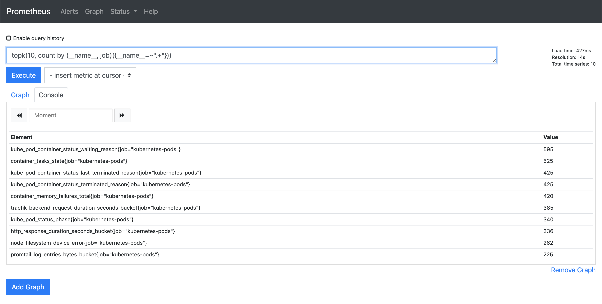

## Prometheus

### Finding most popular metric series

Prometheus can run out of memory if there are too many series for it to track and the memory given is too low for initialization in memory. To inspect the most popular series run the following:

```
topk(10, count by (__name__, job)({__name__=~".+"}))

kube_pod_container_status_waiting_reason{job="kubernetes-pods"}	595
container_tasks_state{job="kubernetes-pods"}	525
kube_pod_container_status_last_terminated_reason{job="kubernetes-pods"}	425
```



Source: https://www.robustperception.io/which-are-my-biggest-metrics
